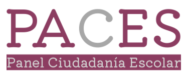

```{r setup_theme, include = FALSE}

light_color <- 'white'
text_color <- '#397CDA'
gray <- "#333333"
blue <- "#4466B0"


library(xaringanthemer)
style_duo(
  # colors
  primary_color = light_color,
  secondary_color = text_color,
  header_color = light_color,
  text_color = text_color,
  code_inline_color = colorspace::lighten(text_color),
  text_bold_color = colorspace::lighten(text_color),
  link_color = light_color,
  title_slide_text_color = text_color,
  background_position = 'center',
  header_font_google = google_font("Lato"),
  text_font_google   = google_font("Lato", "300", "300i"),
  code_font_google   = google_font("Hack"),
  code_highlight_color = 'rgba(58,116,188,0.15)',
  code_font_size = '50%',
  padding = "0.4em 2.4em 0.4em 2.4em",
  extra_fonts = list(google_font("Lato")),
  extra_css = 
  list(
  ".red"    = list(color = "red"),
  ".white"  = list(color = "white"),
  ".bold_white" = list(color = "white", "font-weight" = "bold"),
  ".small" = list("font-size" = "90%"),
  ".pull_l_70"  = list("float" = "left" , "width" = "72%"),
  ".pull_r_30"  = list("float" = "right", "width" = "23%"),
  ".pull_l_60"  = list("float" = "left" , "width" = "60%"),  
  ".pull_r_40"  = list("float" = "right", "width" = "33%"),
  ".pull_l_50"  = list("float" = "left" , "width" = "45%"),
  ".pull_r_50"    = list("fixed" = "right", "width" = "45%"),
  ".small_left"  = list("float" = "left", "width" = "47%", "height" = "50%", "padding-right" = "2%"),
  ".small_right" = list("float" = "right","width" = "47%", "height" = "50%", "padding-left"  = "2%"),
  ".left_code" = list("float" = "left",  "width" = "47%", "height" = "100%", "padding-right" = "2%",
    "font" = "Hack"),
  ".code_out"  = list("float" = "right", "width" = "47%", "height" = "100%", "padding-left"  = "2%",
    "font" = "Hack"),
  ".pull_l_50_1" = list(
    display = "flex",
    width   = "100%",
    height   = "77%",
    "flex-flow" = "column wrap",
    flex    = "1",
    "padding-left"  = "10%"
  ),
  ".pull_l_50_2" = list(
    display = "flex",
    width   = "100%",
    height   = "10%",
    "flex-flow" = "column wrap",
    flex    = "2",
    "padding-left"  = "10%"
  ),  
  ".text_250" = list("font-size" = "250%"),
  ".text_240" = list("font-size" = "240%"),
  ".text_230" = list("font-size" = "230%"),
  ".text_220" = list("font-size" = "220%"),
  ".text_210" = list("font-size" = "210%"),
  ".text_200" = list("font-size" = "200%"),
  ".text_190" = list("font-size" = "190%"),
  ".text_180" = list("font-size" = "180%"),
  ".text_170" = list("font-size" = "170%"),
  ".text_160" = list("font-size" = "160%"),    
  ".text_150" = list("font-size" = "150%"),
  ".text_140" = list("font-size" = "140%"),  
  ".text_130" = list("font-size" = "130%"),
  ".text_120" = list("font-size" = "120%"),
  ".text_110" = list("font-size" = "110%"),
  ".text_110" = list("font-size" = "110%"),
  ".text_100" = list("font-size" = "100%"),
  ".text_90" = list("font-size" = "90%"),
  ".text_80" = list("font-size" = "80%"),
  ".text_70" = list("font-size" = "70%"),
  ".text_60" = list("font-size" = "60%"),
  ".text_50" = list("font-size" = "50%"),
  ".text_40" = list("font-size" = "40%"),
  ".text_30" = list("font-size" = "30%"),
  ".text_20" = list("font-size" = "20%"),
  ".line_space_11" = list("line-height" = "1.1em;"),
  ".line_space_09" = list("line-height" = "0.9em;"),
  ".line_space_07" = list("line-height" = "0.7em;"),
  ".line_space_05" = list("line-height" = "0.5em;"),
  ".line_space_04" = list("line-height" = "0.4em;"),
  ".line_space_03" = list("line-height" = "0.3em;"),
  ".line_space_02" = list("line-height" = "0.2em;"),
  ".line_space_01" = list("line-height" = "0.1em;"),
    ".french" = list(
      "text-indent" = "-30px", 
      "position"= "absolute%",
      "padding-left"= "40px%"
      ),

    ".tiny_text" = list(
      "font-family" = "Lato", 
      "font-size"= "70%"
      ),
    ".large_text" = list(
      "font-family" = "Lato", 
      "font-size"= "150%"
      ),
    ".slide_blue" = list(
      "background-color" = "#397CDA",
      "color" = "white"
      ),
  ".center_image" = list(
    margin  = "0",
    position = "absolute",
    top      = "50%",
    left     = "50%",
    '-ms-transform' = "translate(-50%, -50%)",
    transform = "translate(-50%, -50%)"
    ),
  ".hljs-github .hljs" = list(
    background = 'rgba(58,116,188,0.03)')
  )
)


# 'rgba(25,142,255,0.3)',

knitr::opts_chunk$set(comment = NA)
knitr::opts_chunk$set(dpi=1500)

# preview slides
# xaringan::inf_mr('psi2301_slide_example.rmd')


# padding-top: 0.4em;
# padding-right: 2.4em;
# padding-bottom: 0.4em;
# padding-left: 2.4em;

```
class: title-slide, middle, center

background-image: url(img/mide_logo_2019.png), url(img/coes.png)
background-position: top left, top right
background-size: 10%, 10%

```{r echo=FALSE, out.width = '2%', out.height = '2%'}
knitr::include_graphics('./img/blank_space.png')
```

<br>

.line_space_07[
## El rol de la familia y la escuela
### .text_70[en la socialización política de las actitudes hacia la igualdad de género]
]
<br>

.line_space_03[
.blue[

.text_60[

**Daniel Miranda. Contacto**: damiran1@uc.cl

.text_70[**Centro de Medición MIDE UC - COES**]

**Julio Iturra**

.text_70[**Centro de Estudios de Conflicto y Cohesión Social - COES**]

**Anais Herrera**

.text_70[**Centro de Investigación Avanzada en Educación (CIAE)**]

**Kevin Carrasco**

.text_70[**Universidad de Chile**]

]

<br>

.line_space_02[
.text_70[*ANID/FONDECYT/1181239 - ANID/FONDECYT/11190508*

<br>

*Centro de Estudios de Conflicto y Cohesión Social - COES - ANID/FONDAP/15130009*]
]

<br>

.text_70[**VI Seminario Internacional Desigualdad y Movilidad Social 2021**]

.text_70[Ciudad de Mexico, 3-5 de noviembre de 2021]
]
]

<br>


---
**Contexto: Proyecto FONDECYT 1181239 (2018-2021)**

.pull-left[
- **Socialización política y experiencia escolar: El rol de la familia y la escuela** <br> <br>
- Investigador principal: Cristián Cox <br> <br>
- Estudio Panel Ciudadanía Escolar .red[**PACES**] <br> <br>
- Actualmente realizado estudios de primera ola y levantando segunda
]

.pull-right[

<br><br>

.center[ 

 ]
 

]

---
class: inverse upper
# Estructura de la presentación

- Presentación del problema

- Principales conceptos y antecedentes

- Objetivos e hipótesis

- Datos, variables y métodos

- Resultados

- Discusión
---
**Introducción**

* <p style="text-align: justify;"> En la actualidad existe una amplio esfuerzo en el mundo por promover desde edades tempranas el reconocimiento activo de la igualdad de derechos y libertades entre hombres y mujeres. </p>

* <p style="text-align: justify;"> La importancia de la igualdad traspasa los ámbitos puramente éticos, encontrándose íntimamente relacionada con las posibilidades de desarrollo social y económico de los países, con el sentimiento de plenitud y valía de las personas y con la vida democrática, la convivencia y la cohesión social en general (ONU, 2016; PNUD, 2017). </p>

* <p style="text-align: justify;"> A pesar de los esfuerzos de promoción de igualdad de género, evidencia muestra que las desigualdades se sostienen en diversos espacios de la vida pública y privada. Según Barcena (2016) y CEPAL (2017): </p>

  - Las mujeres están sobrerrepresentadas en los quintiles de menores ingresos
  - Marcada brecha salarial
  - Distribución desigual del uso del tiempo y del trabajo no remunerado en los hogares
  - Menor participación en actividades remuneradas formales
  - Menor probabilidad de contar con una pensión para su vejez

---
**Antecedentes teórico-empíricos**
--

* <p style="text-align: justify;"> El rol de la familia como agente de socialización política ha sido analizado a partir de dos teorías: </p>

  - <p style="text-align: justify;"> Importancia de los recursos socioeconómicos. La evidencia muestra que estudiantes con más recursos tienen actitudes más positivas hacia la igualdad de género (Dotti Sani & Quaranta, 2017; Miranda et al., 2018). </p>
  - <p style="text-align: justify;"> Transmisión intergeneracional de actitudes de apoderados a hijos, constatándose que las actitudes de apoderados hacia la igualdad de género en la esfera pública se relacionan a las actitudes de sus hijos (Spierings, 2015). </p>

--

* <p style="text-align: justify;"> Socialización política en la escuela. </p>

  - <p style="text-align: justify;"> La apertura a la discusión en el aula se asocia con las actitudes hacia la igualdad de género (Schulz & Ainley, 2018) </p>
  - <p style="text-align: justify;"> La proporción de inmigrantes en el aula aumenta el apoyo hacia la igualdad de derechos para inmigrantes (Isac et al., 2012), por lo que se espera que la proporción de niñas en el aula se relacionará con las actitudes hacia la igualdad de género. </p>

---
**Modelo teórico**

```{r, echo=FALSE, out.width = '90%', fig.retina = 1, fig.align='center'}


```


---
**Datos, variables y métodos**

* <p style="text-align: justify;"> Estudio Panel de Ciudadanía Escolar 2019 </p>

  - Estudiantes de segundo año medio que asisten a escuelas de tres regiones chilenas: Antofagasta, Metropolitana y del Maule.
  - Se encuestaron 1635 estudiantes, 744 apoderados y 103 profesores de 64 escuelas.
  - La muestra final utilizada considera las respuestas de 629 estudiantes y sus apoderados.

--

* <p style="text-align: justify;"> Se estimaron Análisis Factoriales Confirmatorios (AFC) para evaluar el grado de ajuste del modelo de medida de la escala en la muestra de estudiantes y en la de apoderados, </p>

* <p style="text-align: justify;"> Debido a que la muestra posee una estructura jerárquica (estudiantes anidados en escuelas), los principales análisis de datos fueron realizados mediante la estimación de regresiones multinivel. </p>

---
**Construcción de variables dependientes**

```{r, echo=FALSE, out.width = '90%', fig.retina = 1, fig.align='center'}


```


---
**Resultados modelos de regresión multinivel**

```{r, echo=FALSE, out.width = '90%', fig.retina = 1, fig.align='center'}


```


---
**Resultados mediación multinivel**

```{r, echo=FALSE, out.width = '90%', fig.retina = 1, fig.align='center'}


```

---
**Resultados mediación multinivel**

```{r, echo=FALSE, out.width = '90%', fig.retina = 1, fig.align='center'}

knitr::include_graphics("images/tab2.png")

```

---
**Resultados mediación multinivel**

```{r, echo=FALSE, out.width = '90%', fig.retina = 1, fig.align='center'}


```


---
**Resultados**

* <p style="text-align: justify;"> Rol preponderante de la transmisión intergeneracional de las actitudes hacia la igualdad de género entre padres e hijos en el proceso de socialización política familiar. Estos resultados demuestran que existe una consistencia actitudinal, que se transmite dentro de la familia, para las tres dimensiones de la igualdad de género analizadas. </p>

* <p style="text-align: justify;"> A diferencia de investigaciones anteriores, el efecto de los recursos socioeconómicos de la familia sobre las actitudes de los jóvenes es principalmente indirecto, estando mediado por las actitudes de los apoderados. Por lo tanto, sigue siendo la transmisión intergeneracional de actitudes la que influye de manera decisiva sobre las actitudes de los estudiantes. </p>

* <p style="text-align: justify;"> Cabe destacar el efecto positivo de la apertura a la discusión en el aula de clases (tanto la percepción individual como grupal) en las tres dimensiones analizadas de las actitudes hacia la igualdad de género, demostrando la importancia de la escuela como un agente de socialización. </p>

* <p style="text-align: justify;"> Adicionalmente, en consonancia con otras investigaciones pertenecer al género femenino y el nivel de conocimiento cívico aparecen como factores relevantes. </p>

---
**Discusión**

<p style="text-align: justify;"> Aunque ambos agentes de socialización muestran un rol relevante en el desarrollo de las actitudes de los estudiantes, .red[es el efecto de la familia el que predomina]. Además, las características analizadas de la escuela no intervienen en la transmisión intergeneracional. En ese sentido, .red[la formación de actitudes favorables a la igualdad de género depende principalmente de las actitudes de los apoderados]. </p>

<p style="text-align: justify;"> Se hace necesario generar mecanismos dentro de la escuela que logren mitigar efectivamente la transmisión intergeneracional de actitudes, ya que de ello depende .red[formar ciudadanos con una opinión favorable a la promoción y garantía de los derechos de todas las personas]. Asimismo, cobra relevancia el rol de la formación ciudadana en la formación de opiniones hacia la igualdad de género y sus implicancias en la construcción de sociedades más democráticas, tolerantes y cohesionadas. </p>

---
class: center, middle


class: title-slide, middle, center

background-image: url(img/mide_logo_2019.png), url(img/coes.png)
background-position: top left, top right
background-size: 10%, 10%

```{r echo=FALSE, out.width = '2%', out.height = '2%'}
knitr::include_graphics('./img/blank_space.png')
```

**¡Muchas gracias por su atención!**

<br>

.line_space_07[
## El rol de la familia y la escuela
### .text_70[en la socialización política de las actitudes hacia la igualdad de género]
]
<br>

.line_space_03[
.blue[

.text_60[

**Daniel Miranda. Contacto**: damiran1@uc.cl

.text_70[**Centro de Medición MIDE UC - COES**]

**Julio Iturra**

.text_70[**Centro de Estudios de Conflicto y Cohesión Social - COES**]

**Anais Herrera**

.text_70[**Centro de Investigación Avanzada en Educación (CIAE)**]

**Kevin Carrasco**

.text_70[**Universidad de Chile**]

]

<br>

.line_space_02[
.text_70[*ANID/FONDECYT/1181239 - ANID/FONDECYT/11190508*

<br>

*Centro de Estudios de Conflicto y Cohesión Social - COES - ANID/FONDAP/15130009*]
]

<br>

.text_70[**VI Seminario Internacional Desigualdad y Movilidad Social 2021**]

.text_70[Ciudad de Mexico, 3-5 de noviembre de 2021]
]
]

<br>


